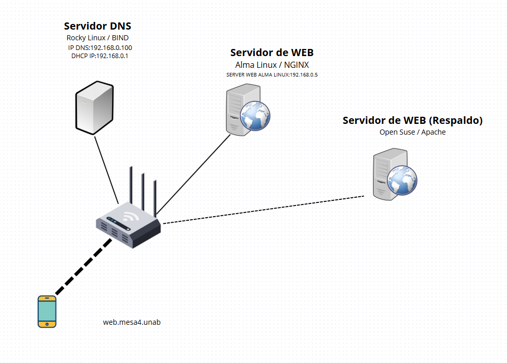

# 🛠️ Simulación de Red Interna con Linux y Alta Disponibilidad (2025)

Este proyecto simula una red interna configurada con servidores Linux y servicios esenciales de red. Se implementaron DNS, Web (Apache y NGINX), DHCP y alta disponibilidad mediante Keepalived. Trabajo realizado para la asignatura **Redes II** en la Universidad Doctor Andrés Bello.

---

## 🎯 Objetivo

Ofrecer una guía práctica para desplegar una red local con:

- Resolución de nombres mediante **BIND** (DNS)
- Servidores web con **NGINX (AlmaLinux)** y **Apache2 (openSUSE)**
- Asignación de IP estática y dinámica con Wicked y NetworkManager
- Alta disponibilidad usando **Keepalived** con IP virtual
- Gestión en entornos simulados usando máquinas virtuales

---

## 📄 Contenido del repositorio

| Archivo               | Descripción                                      |
|-----------------------|--------------------------------------------------|
| `README.md`           | Esta documentación                              |
| `INFORME_MESA4.pdf`   | Informe técnico detallado del proyecto          |

---

## 🔗 Recursos externos

- 📂 **Máquinas virtuales (.OVA)**  
  👉 [Google Drive - OVA Mesa 4](https://drive.google.com/drive/folders/1LLBEUQ8_vJczCaiJEPYEz_a0vMr1zQp6?usp=sharing)

- 📂 **Presentación: Controlador de Dominio**  
  👉 [Google Drive - Guía de Dominio](https://drive.google.com/drive/folders/1O7_c8tu-dbVSd2qaIB7hLUJSDrS-EX7-?usp=sharing)

---

## 🖼️ Estructura de la red

